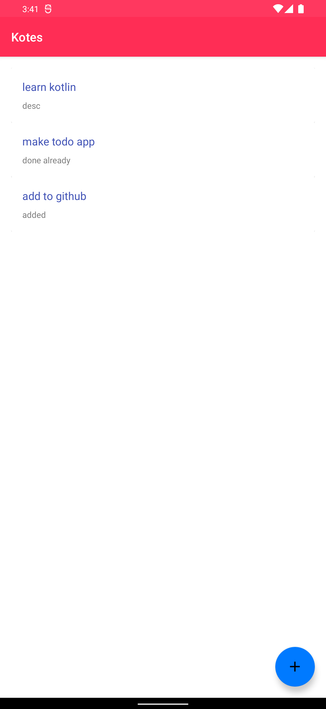

<div align = "center">

<h1><a href="https://2kabhishek.github.io/Kotes">Kotes</a></h1>

<a href="https://github.com/2KAbhishek/Kotes/blob/main/LICENSE">
 </a>

<a href="https://github.com/2KAbhishek/Kotes/pulse">
 </a>

<a href="https://github.com/2KAbhishek/Kotes/stargazers">
</a>

<a href="https://github.com/2KAbhishek/Kotes/network/members">
 </a>

<a href="https://github.com/2KAbhishek/Kotes/watchers">
 </a>

<a href="https://github.com/2KAbhishek/Kotes/graphs/contributors">
 </a>

<a href="https://github.com/2KAbhishek?tab=followers">
 </a>

<h3>Take notes with Kotlin 📔✏️</h3>

<figure>
  
  <br/>
  <figcaption>Kotes screenshot</figcaption>
</figure>

</div>

## What is this

Kotes is an app that allows you to take notes, uses RecyclerView to display the notes, and uses Persistence to store the notes.

## Inspiration

My take on [Qote](https://github.com/2kabhishek/qote) after 3 years.

## Prerequisites

Before you begin, ensure you have met the following requirements:

- You have installed the latest version of `Android Studio`

## Getting Kotes

To install Kotes, follow these steps:

```bash
git clone https://github.com/2kabhishek/Kotes
cd Kotes
```

## How it was built

Kotes was built using `Android Studio` and `Kotlin`.

## What I learned

- Working with RecyclerView and Persistence model was interesting.

Hit the ⭐ button if you found this useful.

## More Info

<div align="center">

<a href="https://github.com/2KAbhishek/Kotes">Source</a> | <a href="https://2kabhishek.github.io/Kotes">Website</a>

</div>
